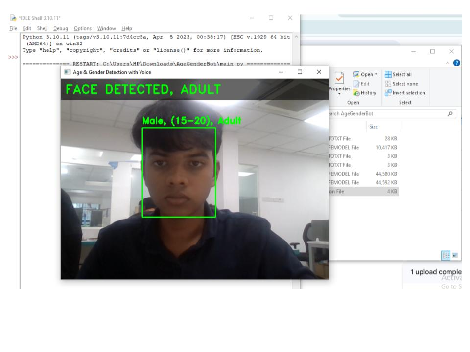

# 👤 AgeGenderBot

An AI-powered application that detects a person's **age** and **gender** in real time using **Python**, **OpenCV**, and pre-trained **Caffe Deep Learning** models.

## 🚀 Features

- 🎥 Real-time webcam face detection
- 👤 Age prediction
- 🚻 Gender prediction
- ⚡ Fast inference using OpenCV DNN

## 🛠️ Technologies Used

- Python
- OpenCV
- NumPy
- Caffe Deep Learning Models

## 📷 Screenshot



## 📦 Installation

```bash
pip install -r requirements.txt
```

## ▶️ Run

```bash
python main.py
```

## 📁 Project Structure

```
AgeGenderBot/
├── main.py
├── models/
├── screenshot/
├── README.md
├── requirements.txt
└── .gitignore
```
